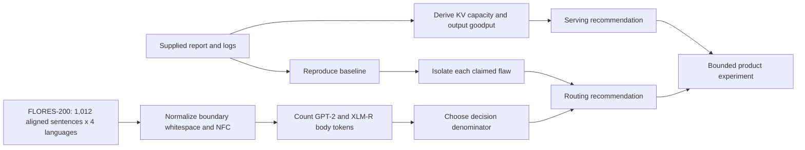

# Multilingual LLM Systems Audit

[](https://github.com/Ramakrishna9-R09/multilingual-llm-systems-audit/actions/workflows/verify.yml)
[](https://www.python.org/)
[](https://github.com/facebookresearch/flores)

> A reproducible, evidence-driven audit of multilingual tokenization, KV-cache
> capacity, serving goodput, and launch decisions.

This project turns a set of plausible benchmark claims into inspectable,
runnable evidence. It separates the supplied audit target from the analysis,
records data provenance and transformations, preserves generated results, and
states where offline evidence stops being enough to make a production decision.

## Executive summary

| Decision area | Evidence-backed conclusion | Primary artifact |
|---|---|---|
| Multilingual routing | Compare **body tokens per matched parallel sentence**, not words or code points. On the 1,012-sentence corpus, GPT-2 BPE costs 7.42x English for Hindi, 13.58x for Kannada, and 15.54x for Tamil. | [Part A memo](your-submission/partA/memo.md) |
| Tokenizer choice | XLM-R's multilingual tokenizer is only 1.25-1.35x English on the same messages. This motivates evaluating a compatible multilingual model family - not swapping tokenizers under a deployed model. | [Corrected metrics](your-submission/partA/results/corrected_metrics.csv) |
| Long-context serving | Each token requires 112 KiB of fp16 KV cache. The L4 estimate is about 25 concurrent 4,096-token sequences; the supplied log begins preempting at batch 32. | [Capacity reconciliation](your-submission/partB/calculations.md) |
| Capacity reporting | Batch 24's 1,607.4 reported tok/s includes prompt tokens. Its generated-token goodput is 200.9 tok/s, independently derived two ways. | [Benchmark reconciliation](your-submission/partB/bench_reconciliation.csv) |
| Product launch | Start with a feature-flagged prompt-only experiment, human-validate Hindi and Kannada, and use explicit success and kill criteria before training or inserting a rewriter. | [Decision memo](your-submission/partC/memo.md) |

## Method at a glance



## Reproduce the audit

### Prerequisites

- Python 3.12+
- PowerShell (the scripts also run on Windows locally)
- Network access only if you omit the local FLORES archive or do not already
  have the GPT-2 tokenizer encoding cached

```powershell
python -m venv .venv
.\.venv\Scripts\python.exe -m pip install -r your-submission\requirements.txt
.\your-submission\run_all.ps1 -Python .\.venv\Scripts\python.exe -FloresArchive .\tmp\flores\flores200_dataset.tar.gz
```

The runner is fail-fast and completes only after all four stages pass:

1. corpus preparation and manifest generation;
2. tokenizer analysis;
3. serving-capacity reconciliation; and
4. targeted unit tests.

To download the official archive on demand, omit `-FloresArchive`. The corpus
preparation script records the archive SHA-256 in its manifest.

## Repository map

| Path | Purpose |
|---|---|
| [`starter_kit/`](starter_kit/) | Supplied audit target, retained unchanged for comparison. |
| [`your-submission/NOTEBOOK.md`](your-submission/NOTEBOOK.md) | Chronological hypothesis -> experiment -> result -> revision log, including a dead end and a later data-hygiene correction. |
| [`your-submission/partA/`](your-submission/partA/) | Corpus preparation, tokenizer audit, corrected analysis, raw results, sources, and routing memo. |
| [`your-submission/partB/`](your-submission/partB/) | Exact KV-cache calculation, benchmark-derived goodput, and long-context admission recommendation. |
| [`your-submission/partC/memo.md`](your-submission/partC/memo.md) | Three-week launch decision with assumptions, arithmetic, success threshold, and kill criterion. |
| [`your-submission/DEFENSE_GUIDE.md`](your-submission/DEFENSE_GUIDE.md) | Compact derivations and counterfactuals for live review. |
| [`your-submission/AI_USAGE.md`](your-submission/AI_USAGE.md) | Transparent record of AI assistance, false starts, and verification boundaries. |

## Reproducibility and quality controls

- **Meaning-aligned evaluation:** complete FLORES-200 `devtest` translations in
  English, Hindi, Kannada, and Tamil, with 1,012 lines per language.
- **Explicit transformations:** UTF-8 decoding, line-ending normalization,
  boundary-whitespace removal, and NFC normalization; no lowercasing or
  interior-whitespace collapsing.
- **Pinned toolchain:** `tiktoken`, `sentencepiece`, and `regex` versions are
  recorded in [`requirements.txt`](your-submission/requirements.txt) and the
  generated environment manifest.
- **Generated artifacts:** all headline numbers trace to checked-in CSV/JSON
  outputs, not a manually edited chart.
- **Continuous verification:** GitHub Actions reruns the analysis and tests on
  every push and pull request.
- **No secrets or private traffic:** the repository contains no API keys,
  production prompts, or user data.

## Scope and limitations

FLORES measures compression on professionally translated web prose, not the
full distribution of assistant traffic. It does not establish generative model
quality, production latency, or natural conversational register. The project
therefore recommends a privacy-safe, intent-stratified production evaluation
and human-language gates before routing or launch decisions.

## Attribution

The repository includes selected FLORES-200 text for reproducibility. FLORES-
200 is CC-BY-SA 4.0; tokenizer and dataset attribution are in
[`NOTICE.md`](NOTICE.md) and [Part A sources](your-submission/partA/sources.md).
